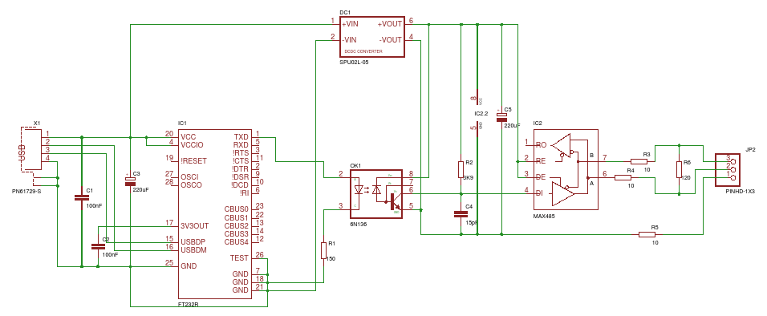

Управление любыми приборами поддерживающие протокол DMX-512 при помощи веб-интерфейса и telegram-бота
===
### Схема сборки переходника

* Вместо микросхемы `FT232RL` можно использовать готовые переходники `FT232 USB UART Board`, но на выход обязательно нужно подключить микросхему `MAX 485 CSA`
* При написании проекта использовался готовый переходник `FT232 USB UART Board (TYPE A)` производителя `WAVESHAR`
